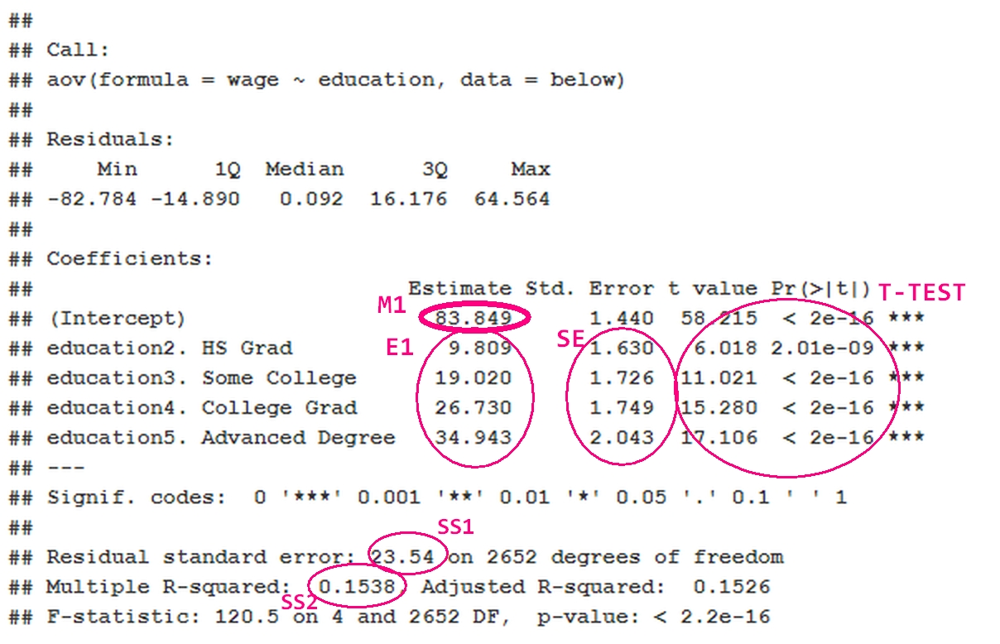
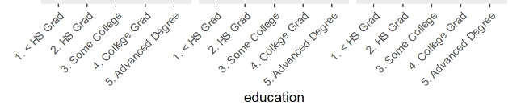

```{r setup, include=FALSE}
knitr::opts_chunk$set(echo = TRUE)
```
# 1. - Introducció.

***

### Lectura

Es carreguen les dades
```{r}
oldwd = getwd() # d:/programfiles/rstudio
setwd("E:/UOC/UOC-MA01/5_ESTADISTICA/PAC4_ST")
dat <- read.csv("data/Wage.csv")
```

#### a)

<p class="subenunciat">Comproveu el tipus de variable que correspon a cada una de les variables.</p>

```{r}

table(dat$maritl)
table(dat$race)
table(dat$education)
table(dat$region)
table(dat$jobclass)
table(dat$health)
table(dat$health_ins)
#  NO hi ha nulls:
sapply(dat, function(x) (sum(is.na(x))))
```
 No hi ha nulls.

#### b)
<p class="subenunciat">Quines són tipus numèric? Quines són tipus factor?</p>
__Numériques:__ year, age, logwage, wage.

__Factors:__ maritl, race, education, region, jobclass, health, heath_ins.

***

# 2. - Estadística descriptiva i visualització.

***

#### a)
<p class="subenunciat">Realitzeu una descriptiva numèrica de les dades.</p>
```{r}
dim(dat)
head(dat)
str(dat)
summary(dat)

```
#### b)
<p class="subenunciat">Mostreu amb diversos diagrames de caixa la distribució de la variable wage segons:<br>
<code>race, jobclass, health i health_ins</code>. Interpretar els gràfics breument..</p>
```{r}

bx2plot <- function(var, by, title){
  boxplot(var ~ by, main = title,xlab="", ylab = "",col = "skyblue")
}

#par(mfrow = c(4,1))

bx2plot(dat$wage, dat$race, "Wage - Race")
bx2plot(dat$wage, dat$jobclass, "Wage - Job Class")
bx2plot(dat$wage, dat$health, "Wage - Health")
bx2plot(dat$wage, dat$health_ins, "Wage - Health Insurance")


```

#### c)
<p class="subenunciat">Podem acceptar que la variable <code>wage</code> té distribució normal. Justifiqueu la vostra resposta recolzant-vos amb mètodes visuals.</p>

```{r message=FALSE}

hist(dat$wage, main = "wage",xlab = "", col = "skyblue")
qqnorm(dat$wage)
qqline(dat$wage)

library(moments)

agostino.test(dat$wage)

pTH <- function(res, alpha, title){
  writeLines(paste("H0:",title))
  if (res < alpha) writeLines(paste("Rebutjat H0. p-valor =",signif(res, digits = 3),"<",alpha))
  if (res >= alpha) writeLines(paste("No es rebutja H0. p-valor =",signif(res, digits = 3),">=",alpha))
}

osh = shapiro.test(dat$wage)

pTH(osh$p.value,0.05,paste("Distribució Normal. ",osh$method))


```

<br>
Visualment, sembla evident que una gran part d'aquesta distribució, sí que és _Normal_, Tant l'__histograma__ com el __QQplot__ mostren que la majoria de dades acompleixen aquesta afirmació. <br>
També s'observa que el test __d'Agostino__ de  _skewness_ rebutja que no hi hagi desviació (_skewness_) i finalment el test __Shapiro-Wilk__ rebutja la Hipòtesi nul·la de la _Normalitat_. 
<br>
Encara que la distribució d'__wage__ no és _Normal_, donat el teorema del límit central, s'assumeix que si la mida de les mostres es n > 30 es comportarà com una distribució normal estàndard (n=3000).

***

# 3. - Estadística inferencial

***

## 3.1 - Interval de confiança de la variable age

#### a) 
<p class="subenunciat">Calcular l’interval de confiança al 95% de la variable __age__ dels treballadors. A partir del valor obtingut, expliqui com s’interpreta el resultat de l’interval de confiança.</p>

<br>

```{r}
alpha2 = (1-0.95)/2

writeLines(paste("alpha2 =",alpha2))

getSigma <- function(var){
  sigmap = sqrt(mean(var^2) - mean(var)^2)
  return(sigmap)
}
getInterval <- function(var){
  alpha2 = 0.025
  z.star = abs(qnorm(alpha2))
  writeLines(paste("z.star =",z.star))
  xm = mean(var)
  n<-length(var)
  sigmap = getSigma(var)
  imin = round(xm - (sigmap/n) * z.star,4)
  imax = round(xm + (sigmap/n) * z.star,4)
  return(paste("(",imin,",",imax,")", collapse = ""))
}

writeLines(paste("Interval de confiança del 95% per Age =",getInterval(dat$age)))
```

Els intervals de confiança ens permeten apropar, un cop calculat el valor de la variable en la mostra, entre quin rang de valors es troba el valor real inaccessible de la variable en la població, amb un grau d'incertesa que podem determinar. De forma estàndard es suposa en 95% de probabilitat.
<br>

#### b) 
<p class="subenunciat">Calcular els intervals de confiança al 95% de la variable __age__, segregant els treballadors per la variable __jobclass__. Quina conclusió en treus de la comparació dels dos intervals, del fet que no es solapin?</p>

Encara que la distribució d'__age__ no és _Normal_, donat el teorema del límit central, s'assumeix que si la mida de les mostres es n > 30 es comportarà com una distribució normal estàndard (n=3000).

```{r}
with(beaver2, tapply(dat$age, dat$jobclass, getInterval))
     
```

Si els intervals no es solapen voldrà dir que el valor mínim de ___Information___ estarà sempre per sobre del valor màxim d'___Industrial___ (amb una propabilitat del 95%). Per tant es conclou que tenen mesures diferents per cada __jobclass__.

<p class="citacio">http://archivos.pap.es/FrontOffice/PAP/front/Articulos/Articulo/_IXus5l_LjPrFG1u0ScQLB219Iu_k8s5e </p>

## 3.2 - Test de comparació de dues mitjanes

<p class="subenunciat">Podem acceptar que els treballadors amb una polissa d’assegurança mèdica variable (<code>health_ins</code>) tenen en mitjana un salari (variable <code>wage</code>) que supera amb més de 20$ el salari dels que no tenen polissa? <br>Calcular-per a un nivell de confiança del 95%. <br>S’assumirà que la variable wage té distribució normal.</p>

### 3.2.1 - Escriure la hipòtesi nul·la i alternativa.

<br>
  <ul><h4>H<sub>0</sub>: &mu; &ge; x + 20 </h4></ul>
  <ul><h4>H<sub>1</sub>: &mu; < x + 20</h4></ul>
  <ul><h4>&alpha; = 0.05</h4></ul>

### 3.2.2 - Justificar quin mètode aplicareu.

<br>
El mètode sel·lecionat és amb la mitja de la població i variància coneguda, seleccionant la cua més petita. En aquest cas, la cua esquerra.


### 3.2.3 - Realitzar els càlculs de l’estadístic de contrast, valor crític i p valor amb un nivell de confiança del 95%.

```{r message=FALSE}

w_ins = dat[c("wage")][(dat$health_ins == "1. Yes"),]
w_noins = dat$wage[dat$health_ins == "2. No"]

### # test estadístic
getZ <- function(var, mu0){
  xm = mean(var)
  n<-length(var)
  sigmap = getSigma(var)
  z = (xm - mu0)/(sigmap/sqrt(n))
  return(z)
}

nomi = mean(w_noins)
writeLines(paste("",nomi))

z_ins = getZ(w_noins, nomi)

z_noins = getZ(w_noins, nomi+20)

writeLines(paste("Valor de z_noins =",round(z_noins,5)))
writeLines(paste("Valor de z_ins =",round(z_ins,5)))

```

Amb **_z_** ja es pot calcular el **valor crític** i el **_p-value_**:
```{r}
alpha= .05
alpha_mitjos = alpha / 2
# Valor crític 
z.alpha =qnorm(1-alpha_mitjos)
writeLines(paste("Valor crític =",round(z.alpha,5)))

#pvalue
pvalue= pnorm(z_ins)
writeLines(paste("p-value =",signif(pvalue, digits = 3)))
```

El __p-valor__ és __0.5__, molt més elevat que 0.05. Així doncs no es pot rebutjar la Hipòtesi H<sub>0</sub>, per tant no es pot rebutjar que els assalariats amb assegurança contractada guanyen 20$ ó més que els que no la tenen.

## 3.3 - Contrast no paramètric.

<p class="subenunciat">En l’apartat 2 hem descartat la normalitat de la variable salari (wage), apliqueu un test no parametric per respondre la pregunta anterior. Podeu usar una funció R per resoldre el contrast.</p>

```{r}
agostino.test(dat$wage)

osh = shapiro.test(dat$wage)

pTH(osh$p.value,0.05,paste("Distribució Normal. ",osh$method))

```

S'observa que el test __d'Agostino__ de  _skewness_ rebutja que no hi hagi desviació (_skewness_) i finalment el test __Shapiro-Wilk__ rebutja la Hipòtesi nul·la de la _Normalitat_. 


***

# 4 - Regressió logística

***

## 4.1 - Model predictiu

#### a)

<p class="subenunciat">Ajusteu un model predictiu basat en la regressio logística per predir la probabilitat de tenir un salari superior a la mitjana en funció de les variables: <code>health_ins</code>, <code>jobclass</code> i <code>age</code>. Preneu com salari mitjà el valor de la mitjana mostral de la variable <code>wage</code>. Codificant 0 quan el salari és inferior i 1 quan el salari és superior o igual. </p>

```{r message=FALSE}

wage_di = dat$wage
mw = mean(wage_di)
wage_di[wage_di < mw] <- 0
wage_di[wage_di >= mw] <- 1

results = glm(wage_di ~ health_ins + jobclass + age, data = dat,family = "binomial"(link='logit'))
summary(results)

# Exemple de predicció:
log.odds <- predict(results, data.frame(health_ins = "1. Yes",
                                        jobclass = "2. Information",
                                        age = 55))

p = round(exp(log.odds)/(1+exp(log.odds)),3)
writeLines(paste("Probabilitat de sou superior a la mitja =",p))

```
<p class="citacio">https://rpubs.com/emilopezcano/logit </p>


#### b)
<p class="subenunciat">Interpreteu el model ajustat. Expliqueu quina interpretació en feu de la contribució en el model de les variables regressores.
</p>

```{r message=FALSE}

exp(coefficients(results))

```

Totes tres variables __health_ins__, __jobclass__ i __age__ tenen una significació molt alta. El seu p-valor és molt petit. Concretament dos valors dels nivells de les variables _factors_.<br>
A més, l'__odds ratio__ mostra en quina mesura cada variable intervé:<li>  Ens diu que  augmentar un punt __health_ins__ [no], suposa un 29% la probabilitat de tenir un salari per sobre de la mitjana. (només té 2 valors) </li><li>
En el cas de __jobclass__ [Information], un punt significa una probabilitat del 80% (només hi ha dos valors) </li><li> __age__ finalment intervé en un 2.6% donant que per cada 10 anys la probabilitat serà d'un 26% d'increment.</li>


## 4.2 - Importancia del nivell d’estudis.

#### c)
<p class="subenunciat">Afegiu en el model anterior la variable <code>education</code>. Interpretar els nivells de la variable <code>education</code> a partir dels odds ratio. En quin % es veu incrementada la probabilitat de tenir un salari superior al salari mitjà segons el nivell educatiu? Proporcioneu intervals de confiança del 95% dels odds ratio.</p>

```{r message=FALSE}


rl_edu = glm(wage_di ~ health_ins + jobclass + age + education, data = dat,family = "binomial"(link='logit'))
summary(rl_edu)

exp(cbind("Odds ratio" = coef(rl_edu), confint.default(rl_edu, level = 0.95)))

```
<p class="citacio">https://stats.stackexchange.com/q/304909 </p>

La probabilitat augmenta molt per cada esglaó d'educació, sent 25 vegades en cas d' 'Advanced Degree'.

## 4.3 - Predicció.

#### d)
<p class="subenunciat">Superaria el salari mitjà un treballador que té polissa mèdica, que treballa a l’àmbit de la informació i té 42 anys d’edat amb formació de graduat? I si es tracta d’un treballador de l’àmbit industrial?</p>

```{r message=FALSE}

# Exemple de predicció:
log.odds <- predict(rl_edu, data.frame(health_ins = "1. Yes",
                                       jobclass = "2. Information",
                                       age = 42,
                                       education = "5. Advanced Degree"))

p = round(exp(log.odds)/(1+exp(log.odds)),3)
writeLines(paste("Informació: Probabilitat de sou superior a la mitja =",p))

log.odds <- predict(rl_edu, data.frame(health_ins = "1. Yes",
                                       jobclass = "1. Industrial",
                                       age = 42,
                                       education = "4. College Grad"))

p = round(exp(log.odds)/(1+exp(log.odds)),3)
writeLines(paste("Industrial: Probabilitat de sou superior a la mitja =",p))

```


<br>

# 5 Anàlisi de la variància (ANOVA)

## 5.1 - Anova d’un factor

### 5.1.1 - Nivell d’educació i salari

<p class="subenunciat">Seleccionar les observacions que tinguin un salari inferior a 150. Per aquest grup de traballadors realitzeu un Anova per contrastar la significació del factor nivell d’eduació en el salari.
</p>

```{r message=FALSE, warning=FALSE}

below = dat[dat$wage < 150,]

library("ggpubr")
ggboxplot(below, x = "education", y = "wage", 
          color = "education", palette = c("#00AFBB", "#E7B800", "#FC4E07","#4B952B", "#522B95"),
          order = c("1. < HS Grad", "2. HS Grad", "3. Some College", "4. College Grad", "5. Advanced Degree"),
          x.text.angle = 45,
          font.xtickslab = c(9, "plain", "black"),
          font.legend = c(8, "plain", "black"),
          ylab = "Wage", xlab = FALSE)
```

<p class="citacio">https://rpkgs.datanovia.com/ggpubr/reference/ggpar.html </p>


### 5.1.1.1 - Hipòtesis nul·la i alternativa

<br>
  <ul><h4>H<sub>0</sub>: &mu;<sub>1</sub> = &mu;<sub>2</sub>= ... = &mu;<sub>n</sub> </h4></ul>
  <ul><h4>H<sub>1</sub>: &mu;<sub>1</sub> &ne;  ...  &mu;<sub>n</sub></h4></ul>
  <ul><h4>&alpha; = 0.05</h4></ul>

### 5.1.1.2 - Model

<p class="subenunciat">Calcular l’anàlisi de variància, utilitzant la funció aov o lm. Interpretar el resultat de l’anàlisi, tenint en compte els valors Sum Sq, Mean SQ, F i Pr (> F).
</p>

```{r message=FALSE, warning=FALSE}

res.aov <- aov(wage ~ education, data = below)
summary(res.aov)

```
<p class="citacio">http://www.sthda.com/english/wiki/one-way-anova-test-in-r </p>
<li>
La suma dels quadrats (__SS__ o __Sum Sq__) és de tipus 1 (* tenen en compte la mida de les series, no depenen del ordre, <a href="http://www.dwoll.de/r/ssTypes.php">dwoll.de/r/ssTypes.php</a> ).</li>
<li>
La __Mean Sq__ es calcula amb aquesta SS (MCE = SCE/(k-1); MCD = SCD/(n-k)). </li><li>
El _F valor_ és __l'estadístic de contrast__ SCE/(k-1) / SCD/(n-k) i senyala la zona d'acceptació o no del valor com pertanyent a la distribució F de Snedecor. </li><li>
El __Pr (> F)__ és el p-valor i ens mostra la probabilitat.</li><li>
En aquest cas el p-valor es molt proper a cero, rebutjant-se la H<sub>0</sub>, per tant __les mitjanes no són iguals__.</li>

### 5.1.1.3 - Càlculs

#### a)
<p class="subenunciat">Per tal d’aprofundir en la comprensió de el model ANOVA, calcular manualment la suma de quadrats intra i la suma de quadrats entre grups. Els resultats han de coincidir amb el resultat de el model ANOVA. Com a referència, pots obtenir les fórmules de López-Roldán i Fachelli (2015), pàgines 29-33.
</p>

```{r}

SCT <- function(df, factor_){
  wages <- split(df$wage, factor_)
  m <- c(); l <- c();  v <- c()
  for (i in wages){
    l <- c(l,length(i))
    m <- c(m,mean(i))
    v <- c(v,var(i))
  }
  d_ = 0;  n_ = 0
  for (i in 1:length(l)){
    n_ = n_ + m[i] * l[i]
    d_ = d_ + l[i]
  }
  mean_global = n_ / d_
  scd = 0
  for (i in 1:length(l)){
    scd = scd + ((l[i]-1) * v[i])
  }
  writeLines(paste("SCD =",round(scd,0)))
  sce = 0
  for (i in 1:length(l)){
    sce = sce + (l[i] * (m[i]-mean_global)^2)
  }
  writeLines(paste("SCE =",round(sce,0)))
}

SCT(below,below$education)
```

#### b)
<p class="subenunciat">També proporciona l’estimació dels efectes del nivells dels factor educació. I l’estimació de la variancia de l’error.
<br><br>
Comprovació amb la funció lm().
</p>

```{r}

summary.lm(res.aov)

```


### 5.1.2 - Interpretació dels resultats:


<ul>
<li>
__M1__ -> Mitja base.</li> <li>
__E1__ -> Estimacions per la diferència entre les mitges de cada grup i el grup de control.</li> <li>
__SE__ -> Error estàndar de les diferències de mitges usant el _MSE_ i __n__ per grup.</li> <li>
__T-TEST__ -> T-test per no diferències entre mitges.</li> <li>
__SS1__ -> Arrel quadrada de la mitja de quadrats residuals (_SCD_).</li> <li>
__SS2__ -> SSTreatment / SSTotal.</li>
</ul>

<p class="citacio">http://homepages.inf.ed.ac.uk/bwebb/statistics/ANOVA_in_R.pdf </p>

## 5.2 - Adequació del model

<p class="subenunciat">Mostra visualment l’adequació de el model ANOVA. Podeu fer servir plot sobre el model ANOVA resultant. En els apartats següents es demana la interpretació d’aquests gràfics.
</p>

```{r}

par(mfrow = c(2,2))
plot(res.aov)

```


### 5.2.1 - Normalitat dels residus:

<p class="subenunciat">Interpretar la normalitat dels residus a partir de l’gràfic Normal Q-Q que es mostra en l’apartat anterior.
</p>

```{r message=FALSE, warning=FALSE}

aov_residuals <- residuals(object = res.aov )
shapiro.test(x = aov_residuals )

```
<p class="citacio">http://www.sthda.com/english/wiki/one-way-anova-test-in-r </p>

Per tal de comprobar la normalitat de la distribució, es mostren els resultats sobre la diagonal, quant més propers a la diagonal, més normal.

El test de _Shapiro-Wilk_ dóna que el p-valor es menor que 0.05, rebutjant la  H<sub>0</sub> = Distribució Normal. Encara que el gràfic no mostra clarament aquesta falta de normalitat en la distribució.

### 5.2.2 - Homocedasticitat dels residus:

<p class="subenunciat">Els gràfics “Residuals vs Fitted”, “Scale-Location” i “Residuals vs Factor levels” donen informació sobre la homocedasticitat dels residus. Interpretar aquests gràfics.
</p>

```{r message=FALSE, warning=FALSE}

plot(res.aov,1)

library(car)
leveneTest(wage ~ education, data = below)

```

Segons aquest gràfic, hi ha alguns ___outliers___: els punts 500, 2192 i 359 es marquen clarament.
<br>
Els altres gràfics no mostren desviacions significatives.

Amb el test de __Levene__ s'obté que no es pot rebutjar la H<sub>0</sub> = Homegeneitat de la variança. P-valor > 0.05.


## 5.3 - ANOVA no paramètric

<p class="subenunciat">Si la validació de les premisses de normalitat i homocedasticitat no es verifiquen es pot aplicar un test no paramètric, per exemple el test de Kruskal-Wallis.<br><br>
Apliqueu un test de Kruskal-Wallis per contrastar si hi ha diferencies entre les etnies (race) pel que fa al salari. Com en l’apartat anterior seleccioneu les observacions amb salari inferior a 150, a més a més, descarteu les que a la variable race tinguin ell valor “4. Other”.
</p>

```{r message=FALSE, warning=FALSE}
below_no4 = below[below$race != "4. Other",]

ggboxplot(below_no4, x = "race", y = "wage", 
          color = "race", palette = c("#00AFBB", "#E7B800", "#FC4E07"),
          order = c("1. White", "2. Black", "3. Asian", "4. Other"),
          x.text.angle = 45,
          font.xtickslab = FALSE,
          font.legend = c(9, "plain", "black"),
          ylab = "Wage", xlab = "Race")

race.kruskal <- kruskal.test(wage ~ race, data = below_no4)
race.kruskal
```

### 5.3.1 - Interpretació dels resultats:

Com el __p-valor__ és menor que __0.05__ es pot determinar que hi ha diferències significatives entre els grups donats.


# 6 - ANOVA multifactorial

<p class="subenunciat">A continuació, es vol avaluar l’efecte de l’ètnia combinat com un altre factor. Primer es realitzarà el anàlisi amb el factor tipus de treball (<code>jobclass</code>) i posteriorment, amb el factor nivell d’educació (<code>education</code>). En aquest apartat es tindrà en compte el subset format per les observacions amb salari inferior a 150 i, a més a
més, descarteu les que a la variable <code>race</code> tinguin el valor “4. Other”, tal com s’ha fet en l’apartat anterior.
</p>

```{r message=FALSE, warning=FALSE}
adjusted = below[c("wage","race","jobclass","education")]
ben4 = adjusted[adjusted$race != "4. Other",]
```

## 6.1 - Factors: ètnia i tipus de treball

### 6.1.1 - Anàlisis visual dels efectes principals i possibles interaccions

<p class="subenunciat">Dibuixar en un gràfic la variable <code>wage</code> en funció de l’ètnia (<code>etnia</code>) i en funció del tipus de treball (<code>jobclass</code>) i, en el seu cas, en funció del nivell educatiu (<code>education</code>). El gràfic ha de permetre avaluar si hi ha interacció entre els dos factors. Per això, es recomana que segueixi els passos:</p>
<ol>
<li>Agrupar el conjunt de dades per ètnia i per tipus de treball. Calcular la mitjana del salari per a cada grup. Per realitzar aquest procés, es pot fer amb les funcions <code>group_by</code> i <code>summarise</code> de la llibreria <code>dplyr</code>.</li>
```{r message=FALSE, warning=FALSE}
library(dplyr)
byRJE <- ben4 %>% 
    group_by(race,jobclass,education) %>% 
    summarise_at(vars(wage), funs(mean(., na.rm=TRUE)))
library(data.table)
setattr(byRJE$race,"levels",c("1. White", "2. Black", "3. Asian"))
```
<p class="citacio">https://stackoverflow.com/a/28677167 <p>

<li>Mostrar el conjunt de dades en forma de taula, on es mostri la mitjana de cada grup segons ètnia i el tipus de treball.</li>
```{r message=FALSE, warning=FALSE}
library(expss)
byRJE %>% 
  tab_cells(round(wage,1)) %>% 
  tab_cols(race, jobclass) %>% 
  tab_stat_cpct() %>% 
  tab_pivot()
```
<li>Mostra en un gràfic el valor mitjà de la variable <code>wage</code> per a cada ètnia i tipus de treball. Pots inspirar-te
en els gràfics de López-Roldán i Fachelli (2015), p.38. Pots realitzar aquest tipus de gràfic usant la funció <code>ggplot</code> de la llibreria <code>ggplot2</code>.</li>
```{r message=FALSE, warning=FALSE}
library(ggplot2)
ggplot(byRJE, aes(x = as.numeric(education), y = wage, colour = jobclass)) + 
  geom_line(aes(color=jobclass)) +
  geom_point() +
  facet_wrap( ~ race) +
  theme(axis.text.x=element_text(angle=45, hjust=1))
```



<p class="sang2" style="font-size:13px">__as.numeric__ elimina les etiquetes de l'educació, però sense no es generen les linies al ser un factor. <p>

<p class="citacio">https://stackoverflow.com/a/15546667 & https://stackoverflow.com/a/31818454 <p>
<li>Interpretar el resultat sobre si només hi ha efectes principals o hi ha interacció entre els factors. si hi ha interacció, explicar com s’observa aquesta interacció en el gràfic.</li>

Si que hi ha interacció entre els factors. S'observa que el valor final de <code>wage</code> no depen només de <code>jobclass</code>, sembla estar influit, tant per <code>race</code> com per <code>education</code> sent diferent per cada variació.

</ol>

<p class="subenunciat">
Caldrà analitzar si la possible interacció observada gràficament és significativa.
</p>


### 6.1.2 Adequació del model

<p class="subenunciat">Interpretar l’adequació de el model ANOVA obtingut usant els gràfics de residus.</p>

```{r message=FALSE, warning=FALSE}
m1 = aov(wage ~ race * education,data=byRJE)
summary(m1)

m2 = aov(wage ~ race * jobclass,data=byRJE)
summary(m2)

```


## 6.2 Factors: ètnia i nivell d’educació

### 6.2.1 Anàlisis visual dels efectes principals i possibles interaccions

```{r message=FALSE, warning=FALSE}
plot(m1,1)
plot(m1,3)
plot(m1,4)

res <- m1$residuals
hist(res,main="Histogram of residuals",xlab="Residuals")

```

Segons els resultats del model, l'educació sí que és significativa, però molt menys ho es la etnia o el tipus de treball que no tenen p-valors ni tan sols propers a 0.05.<br>
<br>
Gràficament:
<ul>

<li> __Residuals vs Fitted__ : mostra alguns outliers al punt 110.</li>
<li> __Scale-Location__: s'observa que no hi ha un patró aleatori, podent significar que __la variable afecta la resposta__.</li>
<li> __Cook's distance__: mostra els punts amb major influència (_leverage points_). Que són els mateixos que ja s'ha detectat com outliers: 15, 20 i 24.</li>
<li> __Histograma de residus__: és centrat i _normal_ no apareix cap presència d'_outliers_ ni _skewness_.</li>

</ul>

<p class="citacio">https://support.minitab.com/en-us/minitab-express/1/help-and-how-to/modeling-statistics/anova/how-to/two-way-anova/interpret-the-results/all-statistics-and-graphs/ </p><p class="citacio">https://www.theanalysisfactor.com/linear-models-r-diagnosing-regression-model/</p>

# 7 Comparacions múltiples

<p class="subenunciat">Prenent com a referència el model ANOVA multifactorial, amb els factors ètnia i tipus de treball, aplicar el test de comparació múltiple Scheffé. Interpretar el resultat del test i indicar quins grups són diferents significativament entre si.
</p>

```{r message=FALSE, warning=FALSE}

m2 = aov(wage ~ race * jobclass,data=byRJE)
summary(m2)

library(agricolae)
comparison <- scheffe.test(m2,"race", group=TRUE,console=TRUE,
main="Wages\nBy different race")

```
<p class="citacio">https://rdrr.io/cran/agricolae/man/scheffe.test.html </p>

Segons el resultat del test de __Scheffe__, no hi ha diferències significatives entre les mitges de cada grup per <code>wage</code> ~ <code>race</code> * <code>jobclass</code>.

# 8 - Conclusions


S'ha portat a terme un repàs general de l'assignatura amb l'afegit del anàlisi de la variància.<br><br>

S'ha estudiat el conjunt de dades segons l'__estadística descriptiva__. S'ha visaualitzat els gràfica més habituals, com els boxplots de les variables a estudiar, l' histograma per <code>wage</code> i el __qqplot__ per trobar la _normalitat_ de <code>wage</code> ja que es la variable resultant que s'estudia.<br><br>

Segons l'__estadística inferencial__ s'ha estudiat l'interval de confiança per <code>age</code>, s'ha comparat la mitjana de <code>wage</code> segons si el treballador te o no <code>health_ins</code> on s'ha trobat que una mateixa variable pot ser estudiada paramètricament o no paramètricament només canviant com es fan les sub seleccions.<br><br>

Amb la __regressió logística__ s'ha vist com agrupar i com predir segons una certa quantitat de variables amb un resultat de probabilitat i com depenen les variables entre si per obtenir aquestes prediccions.<br><br>

__ANOVA__ mostra la comparació de variància entre varies variables o per una variable segons un o més factors. Inclós sense normalitat en les sèries gràcies al test de _Kruskall-Wallis_.
<br><br>

*** 


